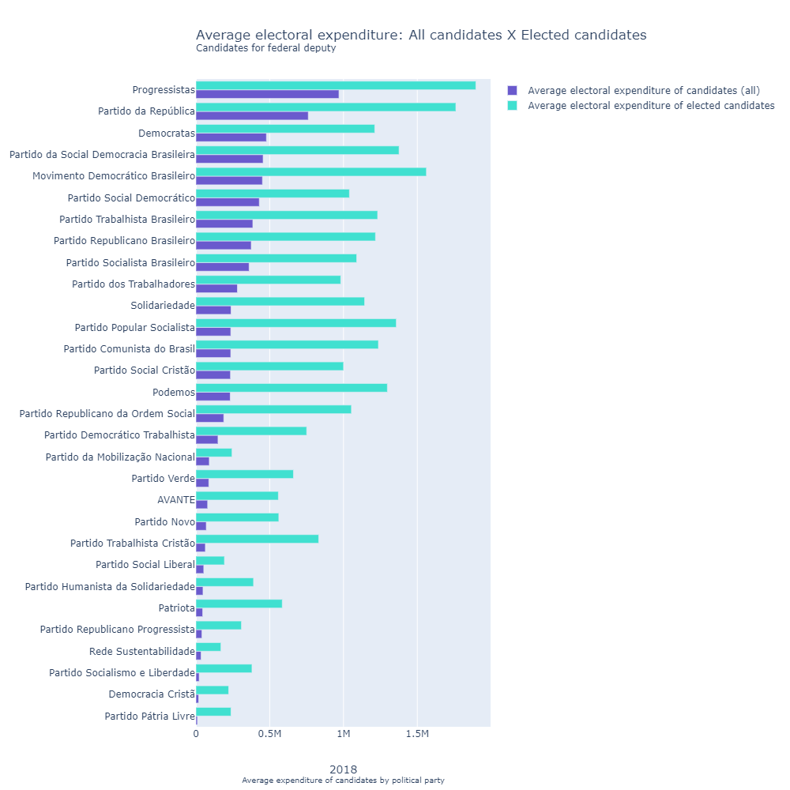

# Brazilian Elections: Electoral expenses of candidates for federal deputy (2018)

## Main goal: 
To analyze the average electoral expenditure of candidates for federal deputy in the 2018 federal elections.
The focus is to compare the average electoral expenses of these candidates across states and also across political parties.
It is also of interest to compare the overall average electoral expenditure of candidates to the average electoral expenditure of elected candidates, by state and by political party. The project is in Python.

## How to use

Visualizations are already generated in html in the `out` folder, they are:

* `map_state`: Map with the average expenses of candidates for federal deputy, by state (2018)
* `graph_party`: Average electoral expenditure of candidates for federal deputy, by political party (2018)
* `graph_comp_state`: Comparison between the average electoral expenditure of all candidates and elected candidates, by state (2018)
* `graph_comp_party`: Comparison between the average electoral expenditure of all candidates and elected candidates, by political party (2018)

## Database used

The data source is from the Superior Electoral Court of Brazil (TSE - BR). In this project, treated tables of the organization [Basedosdados](https://basedosdados.org/dataset/br-tse-eleicoes) for the year 2018 were used. The focus was to filter the analysis on federal deputies, using the tables `basedosdados.br_tse_eleicoes.despesas_candidato` e `basedosdados.br_tse_eleicoes.resultados_candidato`. 

## Visualization

Note: To access all the resources of the visualizations, open them through the html files.

## Libraries required:

* [geopy](https://pypi.org/project/geopy/)
* [pandas](https://pypi.org/project/pandas/)
* [matplotlib](https://pypi.org/project/matplotlib/) 
* [plotly](https://pypi.org/project/plotly/)
* [basedosdados](https://pypi.org/project/basedosdados/)
* [ibge](https://pypi.org/project/ibge/)